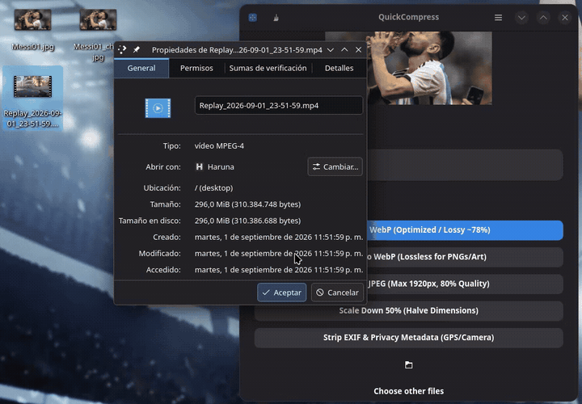
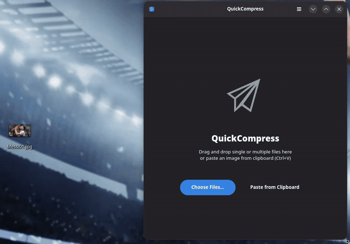

# QuickCompress

<div align="center">
  <h3>⚡ Fast, native Linux utility to compress and convert images, audio, and video for chat and web.</h3>
</div>

---

<div align="center">
  
  <p><em>Interactive frame scrubber, integrated video player preview & target-size compression (&lt; 10 MB / &lt; 25 MB).</em></p>
</div>

<div align="center">
  
  <p><em>Instant image optimization & conversion (e.g. 21 MB &rarr; 247 KB, -99%).</em></p>
</div>

---

## ✨ Features

- 🖼️ **Image Compression & Conversion:** Convert instantly to WebP (Lossy/Lossless), compress JPEG (80% quality, max 1920px), scale down 50%, strip EXIF/GPS metadata.
- 🎬 **Video Optimization & Trimming:** Interactive timeline scrubber, integrated audio/video player, start/end trimming, and exact target size compression (e.g., `< 10 MB` for Discord/WhatsApp, `< 25 MB` for Email/Telegram).
- 🎵 **Audio Optimization:** Native extraction and compression.
- 📋 **Clipboard Direct Support:** Paste an image directly (`Ctrl+V`) from clipboard.
- 🔄 **In-App Self-Updater:** Seamless update checks and 1-click update & restart.
- 🎨 **Modern Native UI:** Built with GTK4 and Libadwaita following GNOME HIG, responsive adaptive layout and dark mode support.
- 🔒 **100% Local & Private:** No cloud, no telemetry, all processing happens locally on your machine with FFmpeg.

---

## 🛠️ Tech Stack

- **Language:** [Rust](https://www.rust-lang.org/)
- **UI Toolkit:** [GTK4](https://gtk.org/) & [Libadwaita](https://gnome.pages.gitlab.gnome.org/libadwaita/)
- **Backend:** `image`, `oxipng`, `ffmpeg`

---

## 🚀 Building from Source

### Prerequisites

Ensure you have Rust and the development headers installed.

**Arch / CachyOS:**
```bash
sudo pacman -S rust gtk4 libadwaita ffmpeg
```

**Fedora:**
```bash
sudo dnf install rust cargo gtk4-devel libadwaita-devel ffmpeg-free-devel
```

**Ubuntu / Debian:**
```bash
sudo apt install cargo libgtk-4-dev libadwaita-1-dev ffmpeg
```

### Run in Development

```bash
cargo run
```

---

## 📜 License

Licensed under the [GNU General Public License v3.0](LICENSE).
